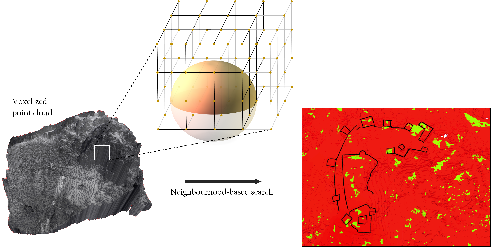
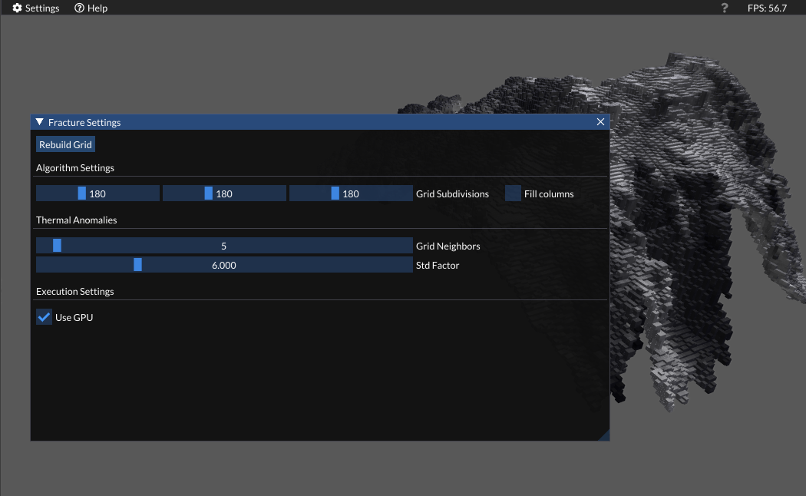
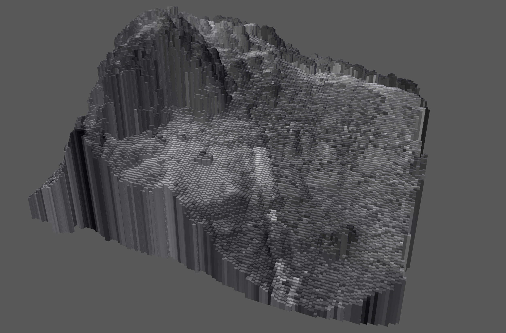
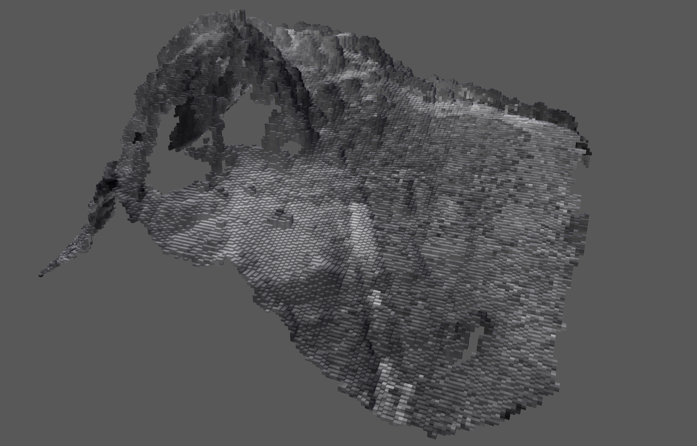
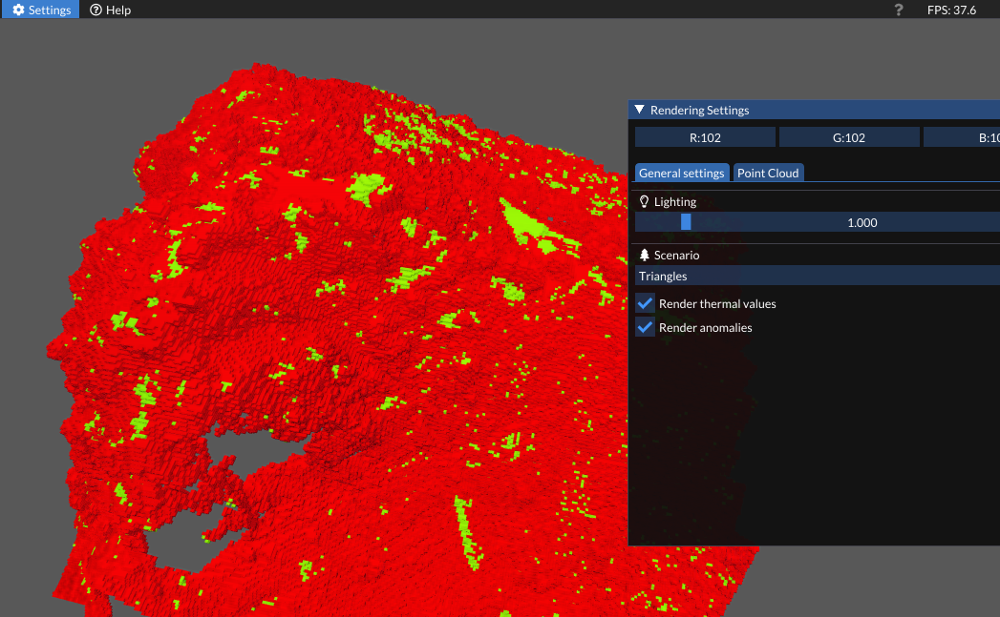

# Detection of anomalies in thermal point clouds

 
 
 

Voxelization of thermal point clouds in OpenGL, using compute shaders, to render anomalous voxels according to their temperature in contrast to their neighbourhood.

This repository is intended for the search of anomalies in archaeological sites, accompanying our work '**Detection of landscape features with visible and thermal imaging at the Castle of Puerta Arenas**', 2023, Archaeological and Anthropological Sciences, Carolina Collaro, Carmen Enríquez‑Muñoz, Alfonso, López‑Ruiz, Carlos Enríquez & Juan‑Manuel Jurado‑Rodríguez.

     

## Downloads

You can find the executable file in the Release tab of Github. This version was generated under a Windows 10 System (64 bits) using Microsoft Visual Studio.

## Get started

### Input thermal point cloud

The current project only supports `.ply` point clouds, which must adjust to the following scheme:
- Root element: `vertex`.
    - Position: `x`, `y`, `z`.
    - Color: `red`, `green`, `blue`, encoding a grayscale thermal representation in a `vec3`.
    - Temperature: `temperature` **[Optional]**. If this field cannot be found, the temperature will be retrieved from the `red` channel.

The read point cloud must be located at `Assets/PointCloud/ThermalPointCloud.ply`.

### Runtime parameters

The published project is able to recalculate the voxelization and calculate new anomalies according to a neighborhood size and a $\sigma$ threshold to adjust the sensitivity of the pipeline. Note that, by default, no anomalies are displayed until they are calculated once. To this end, please click the `Rebuild grid` button, which computes the regular grid as well as the outlier voxels.

The following image shows a screenshot of the Graphical User Interface (GUI) that enables setting all these parameters.

     
    <em>GUI for configuring the regular grid dimensions and search of thermal anomalies.</em>

The seek for thermal anomalies starts by indexing the point cloud into a regular grid which also can be recalculated. For visualization purposes, voxels can be filled to reach the bottom boundaries or simply generate the occupied voxels:

     
    <em>Filled voxels in regular grid, simply for rendering purposes.</em>

     
    <em>Voxels occupied by 3D points, without filling the regular grid as in the previous image.</em>

Finally, once the $\sigma$ and number of neighbors are configured, voxels can be rendered according to whether they have been identified as outliers or not.

     
    <em>Anomalies detected over the previous voxelization.</em>

## How to cite

    @article{collaro_detection_2023,
    	title = {Detection of landscape features with visible and thermal imaging at the {Castle} of {Puerta} {Arenas}},
    	volume = {15},
    	issn = {1866-9565},
    	url = {https://doi.org/10.1007/s12520-023-01831-3},
    	doi = {10.1007/s12520-023-01831-3},
    	language = {en},
    	number = {10},
    	urldate = {2023-12-31},
    	journal = {Archaeological and Anthropological Sciences},
    	author = {Collaro, Carolina and Enríquez-Muñoz, Carmen and López, Alfonso and Enríquez, Carlos and Jurado, Juan M.},
    	month = sep,
    	year = {2023},
    	keywords = {Photogrammetry, Structure from motion, Archaeology, Thermography, Unmanned aerial systems},
    	pages = {152}
    }
